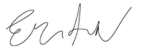

::: from
Erin Grand  
64 W 108th St #6B   
New York, NY 10025  
Email: eringrand@gmail.com 
:::

Space Telescope Science Institute   
3700 San Martin Drive   
Baltimore, MD 21218   

::: date
June 23, 2020
:::

To whom this may concern,

Hello, my name is Erin Grand and I am writing in response to your open position for an Astronomical Data Scientist position at Space Telescope Science Institute, as seen on Twitter.  While I was confident from the posting alone that this would be a great next step in my career, discussing the position and expectations with Dr. Arfon Smith and Dr. Ivelina Momcheva cemented it for me. Between my research work and practical experience, I bring a combined 9 years of experience in both data science and astronomy to a role that feels perfectly tailored to all of my interests.

I received both my undergraduate and masters degrees in astronomy from the University of Maryland in 2007 and 2014 respectively.  During my course of study, I worked at NASA to create an [ultraviolet mosaic of Andromeda](https://www.nasa.gov/mission_pages/swift/bursts/uv_andromeda.html). This image has been featured on [Astronomy Picture of the Day](https://apod.nasa.gov/apod/ap101027.html) twice since publication. As part of my thesis research, I spent 3 years working with data from the CARMA radio observatory to study dense gas in star forming regions. I also worked with the Education and Public Outreach sector at NASA Goddard Space Flight Center on two projects, the Science on a Sphere data library, and the traveling Hubble Space Telescope museum exhibit. 

My research work drove me to pursue a career in data science, because of my love of statistics and coding.  Since then I have applied my skills at organizations that have true public good in mind, such as my past work at the Crisis Text Line.  While there, I was able to use data to help redefine the application process to bring in the best people to be counselors. At Uncommon Schools, a charter management organization with more than 50 schools, I created several predictive models to help teachers identify students most at risk of not passing state exams.

A driving career goal for me has been to combine my astronomy and data science passions to further science. I’m excited to apply this energy and determination to grow and learn at Space Telescope Science Institute. 

Thank you for your consideration.

Sincerely yours, 

  
Erin Grand
